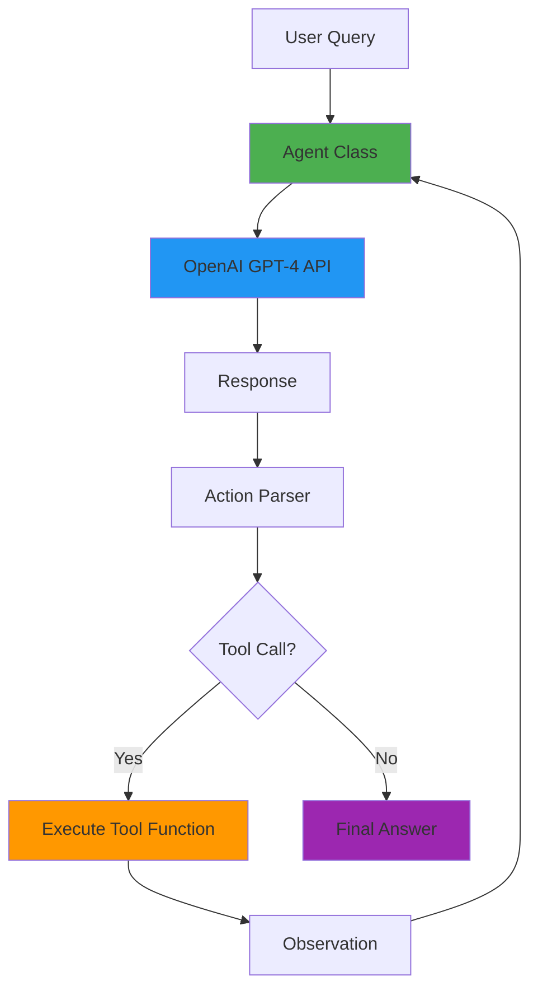
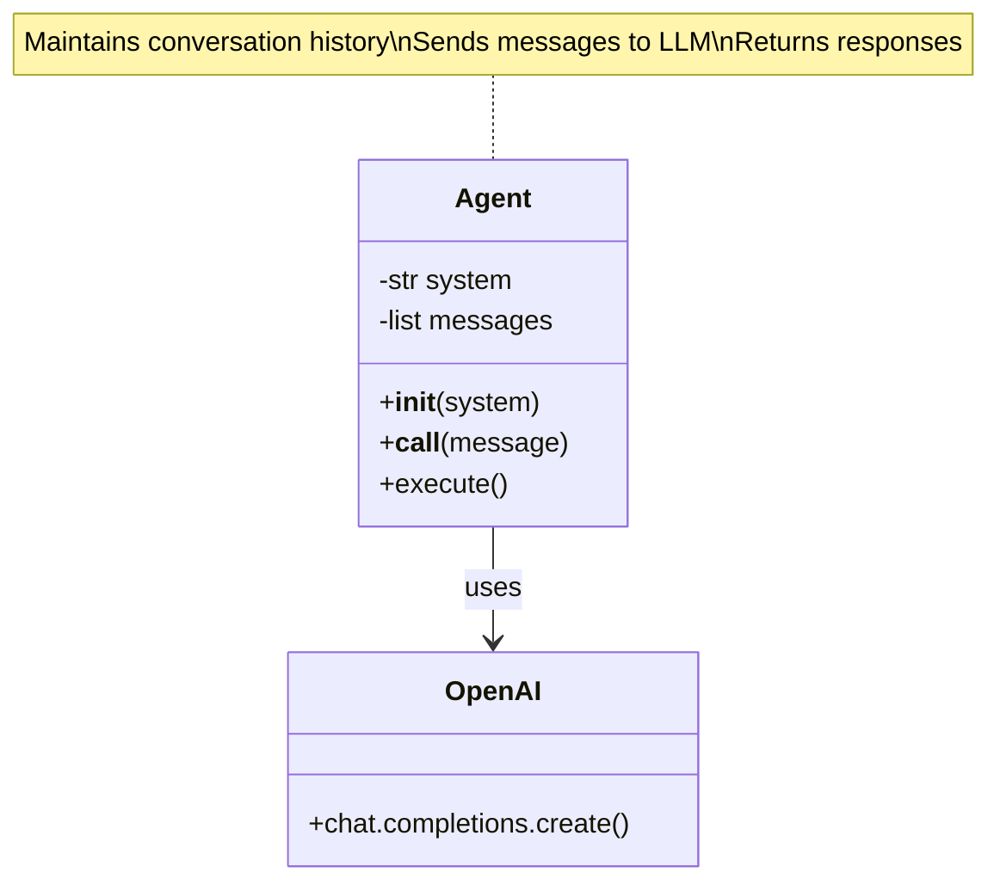
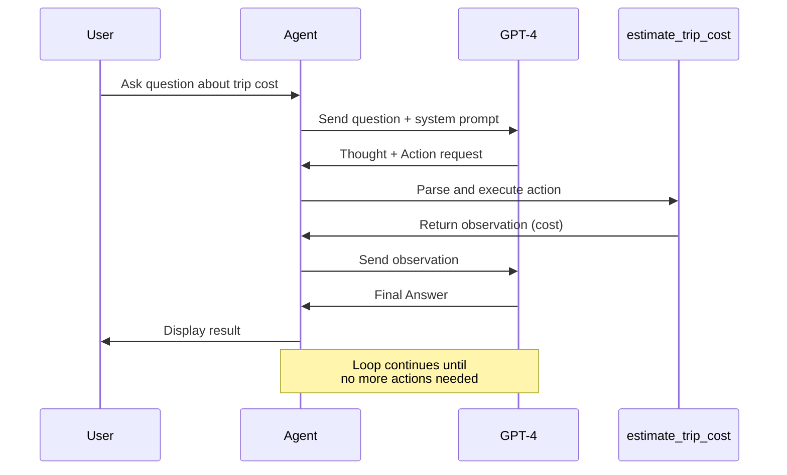
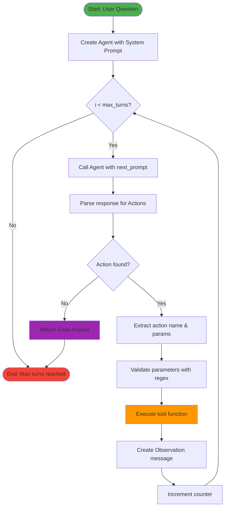
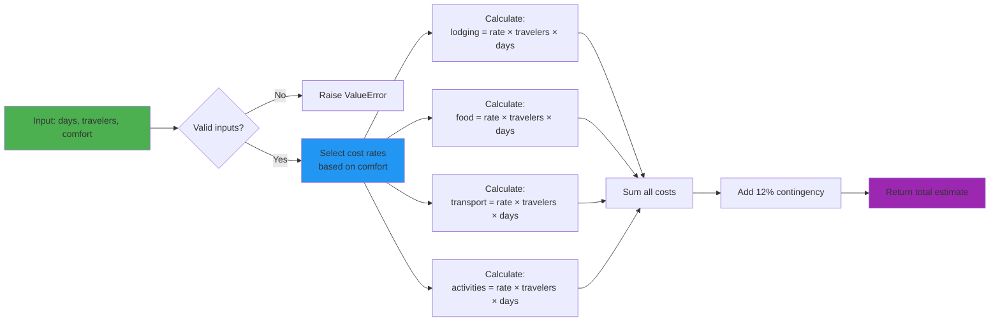
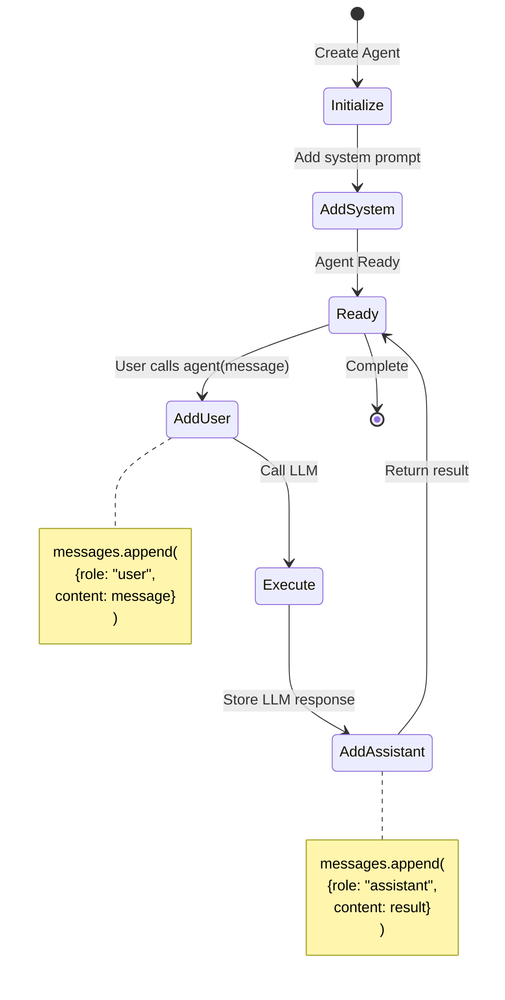
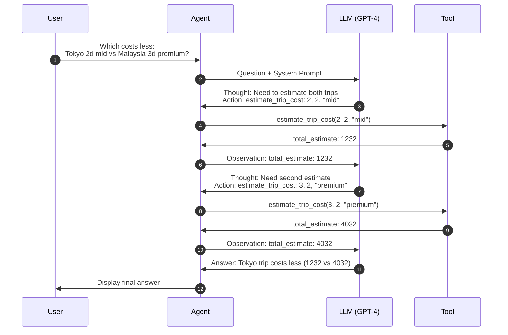

```mermaid
graph TB
    User[User Query] --> Agent[Agent Class]
    Agent --> OpenAI[OpenAI GPT-4 API]
    OpenAI --> Response[Response]
    Response --> Parser[Action Parser]
    Parser --> Tool{Tool Call?}
    Tool -->|Yes| Execute[Execute Tool Function]
    Tool -->|No| Final[Final Answer]
    Execute --> Observation[Observation]
    Observation --> Agent

    style Agent fill:#4CAF50
    style OpenAI fill:#2196F3
    style Execute fill:#FF9800
    style Final fill:#9C27B0
```

```mermaid
classDiagram
    class Agent {
        -str system
        -list messages
        +__init__(system)
        +__call__(message)
        +execute()
    }

    class OpenAI {
        +chat.completions.create()
    }

    Agent --> OpenAI : uses

    note for Agent "Maintains conversation history\nSends messages to LLM\nReturns responses"
```

```mermaid
sequenceDiagram
    participant User
    participant Agent
    participant LLM as GPT-4
    participant Tool as estimate_trip_cost

    User->>Agent: Ask question about trip cost
    Agent->>LLM: Send question + system prompt
    LLM->>Agent: Thought + Action request
    Agent->>Tool: Parse and execute action
    Tool->>Agent: Return observation (cost)
    Agent->>LLM: Send observation
    LLM->>Agent: Final Answer
    Agent->>User: Display result

    Note over Agent,LLM: Loop continues until<br/>no more actions needed

```

```mermaid
flowchart TD
    Start([Start: User Question]) --> Init[Create Agent with System Prompt]
    Init --> Loop{i < max_turns?}
    Loop -->|No| End([End: Max turns reached])
    Loop -->|Yes| Call[Call Agent with next_prompt]
    Call --> Parse[Parse response for Actions]
    Parse --> Check{Action found?}
    Check -->|No| Answer[Return Final Answer]
    Check -->|Yes| Extract[Extract action name & params]
    Extract --> Validate[Validate parameters with regex]
    Validate --> Execute[Execute tool function]
    Execute --> Obs[Create Observation message]
    Obs --> Inc[Increment counter]
    Inc --> Loop
    Answer --> End

    style Start fill:#4CAF50
    style Execute fill:#FF9800
    style Answer fill:#9C27B0
    style End fill:#f44336
```

```mermaid
flowchart LR
    Input[Input: days, travelers, comfort] --> Validate{Valid inputs?}
    Validate -->|No| Error[Raise ValueError]
    Validate -->|Yes| Select[Select cost rates<br/>based on comfort]
    Select --> Calc1[Calculate:<br/>lodging = rate × travelers × days]
    Select --> Calc2[Calculate:<br/>food = rate × travelers × days]
    Select --> Calc3[Calculate:<br/>transport = rate × travelers × days]
    Select --> Calc4[Calculate:<br/>activities = rate × travelers × days]
    Calc1 --> Sum[Sum all costs]
    Calc2 --> Sum
    Calc3 --> Sum
    Calc4 --> Sum
    Sum --> Buffer[Add 12% contingency]
    Buffer --> Return[Return total estimate]

    style Input fill:#4CAF50
    style Select fill:#2196F3
    style Return fill:#9C27B0
```

```mermaid
stateDiagram-v2
    [*] --> Initialize: Create Agent
    Initialize --> AddSystem: Add system prompt
    AddSystem --> Ready: Agent Ready
    Ready --> AddUser: User calls agent(message)
    AddUser --> Execute: Call LLM
    Execute --> AddAssistant: Store LLM response
    AddAssistant --> Ready: Return result
    Ready --> [*]: Complete

    note right of AddUser
        messages.append(
            {role: "user",
             content: message}
        )
    end note

    note right of AddAssistant
        messages.append(
            {role: "assistant",
             content: result}
        )
    end note
```

```mermaid
sequenceDiagram
    autonumber
    participant U as User
    participant A as Agent
    participant L as LLM (GPT-4)
    participant T as Tool

    U->>A: Which costs less:<br/>Tokyo 2d mid vs Malaysia 3d premium?
    A->>L: Question + System Prompt
    L->>A: Thought: Need to estimate both trips<br/>Action: estimate_trip_cost: 2, 2, "mid"
    A->>T: estimate_trip_cost(2, 2, "mid")
    T->>A: total_estimate: 1232
    A->>L: Observation: total_estimate: 1232
    L->>A: Thought: Need second estimate<br/>Action: estimate_trip_cost: 3, 2, "premium"
    A->>T: estimate_trip_cost(3, 2, "premium")
    T->>A: total_estimate: 4032
    A->>L: Observation: total_estimate: 4032
    L->>A: Answer: Tokyo trip costs less (1232 vs 4032)
    A->>U: Display final answer
```
